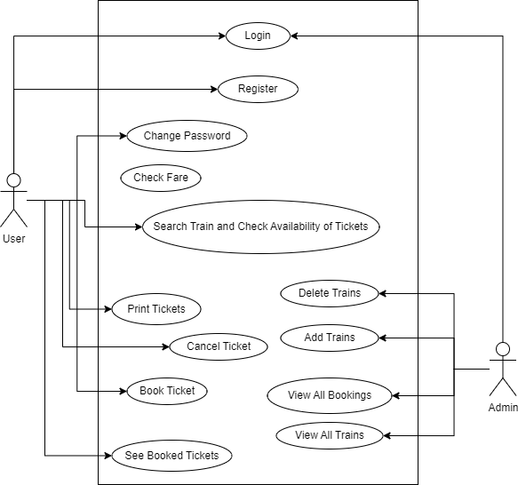
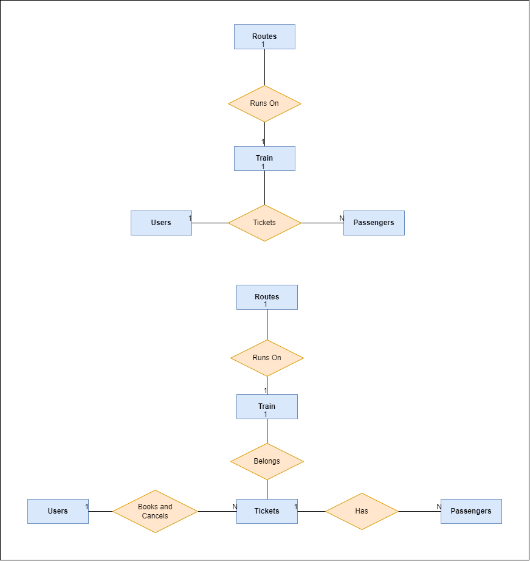
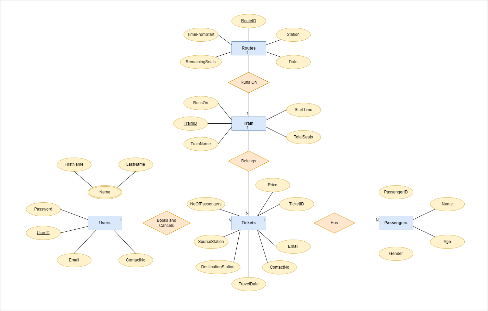
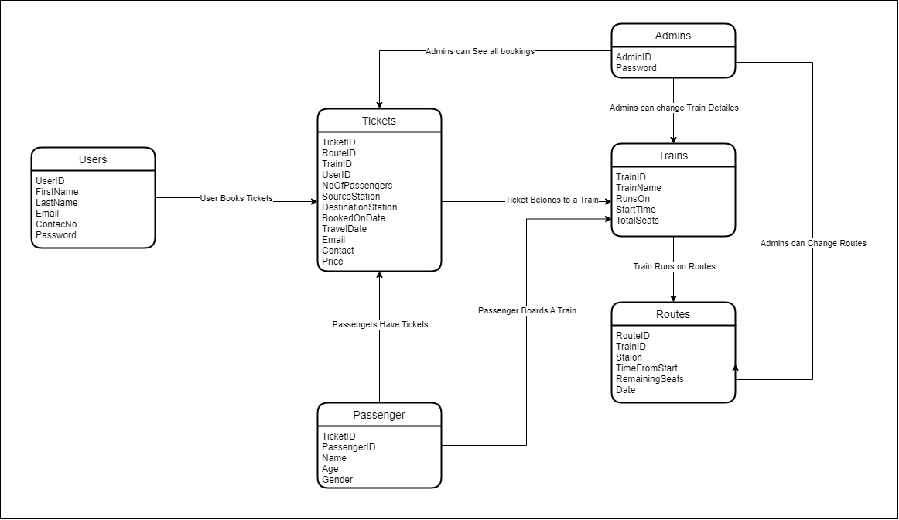
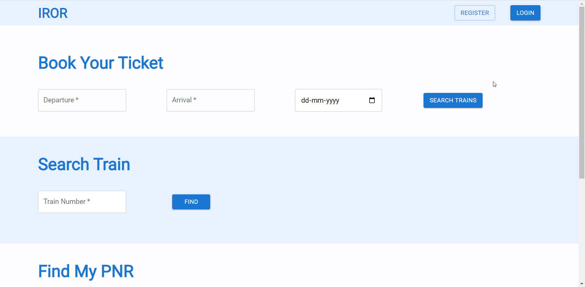

Testning
# IROR - DBMS MINI PROJECT

# Problem Statement

The railway network of our country is one of the most complex public establishments. You can design a database solution for this network and make the management of the same more natural. Your system should have the following pieces of information:
The objective of the online railway ticket reservation system

That is:

1. To create a database of the trains
2. To search the trains it’s arrival and departure times, and distance between the source and
destination.
3. To check the availability of the ticket.
4. To calculate the fare.
5. To book the ticket.
6. To cancel the ticket if necessary. Online railway ticket reservation is an online ticket booking website, which is capable of booking tickets and searching the train availability.

This website is mainly created to fulfill the following requirements, it comprises the following properties:

- A central database that will store all information.
- An online website that will provide real-time information about the availability of tickets and their prices.
- Every registered user is able to view his booking id that has been made in his/her name.
- Every registered user can change his password any time he wants to change it.
- Every guest user can search train availability, price of the ticket, arrival and departure time, distance between source and destination, etc.
- Every registered user has the facility to print his ticket any time he wishes.
- Administration login. In admin mode, the administrator can make changes in train details. He can also view all booking that has been made by different users.
- The booking window contains all the facilities in one place, the user can simply log in to his account and can book his ticket.

# **Objectives**

- The railway reservation system's main goal is to offer the railway network a structural framework.
- Only the administrator is granted access because the project is fully established on the administrative end.
- The project gives the railway system functionality and flexibility so that anybody can use it quickly and effectively.
- Additionally, this project offers a comprehensive array of solutions for several typical and specialized railroad work-related problems.

# **Purpose of IROR**

The Ministry of Railways of the Government of India owns Indian Railways, a legal organization. It controls India's 7,325 stations and 67,956 km (42,226 mi) of total route length, making it the fourth biggest national railway system in the world by size. It has millions of passengers in it and runs 13,169 passenger trains every day, so managing it manually would be a difficult task. By computerizing it, we will be able to overcome many of its limitations and make it more efficient. If the system is automated, handling the data and records for such a big system can be considerably simpler than it would be if it were done manually.

# Features of IROR

- IROR offers up-to-the-minute details on ticket costs and availability.
- Every registered user gets access to their tickets and the option to print them whenever they want.
- Each visitor can do a search for the availability of trains, ticket costs, arrival and departure times, distances between sources and destinations, train routes and other information.
- IROR also offers services such as listings of available trains, verifying the status of PNRs, seat availability, and more.
- In admin mode, the administrator can make changes to train details. The administrator may also see every booking that has been made by various users.
- Passengers can simply cancel their tickets without paying any fees if they choose to do so.
- IROR also offers its users data security.

# Use Case Diagram



# ER Model

## Removal of Non-Binary Relationship



## Adding Attributes to Entities



# Relation Model and Normalization



| Entities | Attributes |
| --- | --- |
| Users | UserID, Email, ContactNo, FirstName, LastName, Password |
| Trains | TrainID, TrainName, RunsOn, StartTime, TotalSeats |
| Routes | RouteID, TrainID, Station, TimeFromStart, RemainningSeats, Date |
| Tickets | TicketID, TrainID, RouteID, UserID, NoOfPassengers, SourceStation, DestinationStation, ContactNo, Email, Price |
| Passengers | PassengerID, TicketID, Name, Age, Gender |

## Normalized Tables

### Users

UserID → Email, ContactNo, FirstName, LastName, Password

Email → UserID

ContactNo → UserID

**Candidate Keys: {**UserID**}, {**Email**}, {**ContactNo**}**

**Primary Keys: {**UserID**}**

### Trains

TrainsID → TrainName, RunsOn, StartTime, TotalSeats

TrainName → TrainsID

**Candidate Keys: {**TrainID**}, {**TrainName**}**

**Primary Keys: {**TrainID**}**

### Routes

RouteID, TrainID, Station → TimeFromStart, RemainningSeats, Date

**Candidate Keys: {**RouteID, TrainID, Station**}**

**Primary Keys: {**RouteID, TrainID, Station**}**

### Tickets

TicketID → TrainID, RouteID, UserID, NoOfPassengers, SourceStation, DestinationStation, ContactNo, Email, Price

TrainID, RouteID, UserID → TicketID

**Candidate Keys: {**TicketID**}, {**TrainID, RouteID, UserID**}**

**Primary Keys: {**TicketID**}**

### Passengers

PassengerID → TicketID, Name, Age, Gender

**Candidate Keys: {**PassengerID**}**

**Primary Keys: {**PassengerID**}**

# Backend

## CREATE TABLE Queries

**Users Table**

```sql
CREATE TABLE Users (
	UserID SERIAL,
	FirstName VARCHAR(15) NOT NULL,
	LastName VARCHAR(15) NOT NULL,
	Email VARCHAR(30) NOT NULL,
	ContactNo BIGINT NOT NULL,
	Password VARCHAR(40) NOT NULL,
	CONSTRAINT PK_Users PRIMARY KEY(USERID),
	CONSTRAINT U_Email UNIQUE (Email),
	CONSTRAINT U_Contact UNIQUE (ContactNo)
);
```

**Trains Table**

```sql
CREATE TABLE Trains (
	TrainID SERIAL,
	TrainName VARCHAR(40) NOT NULL,
	RunsOn VARCHAR(10) NOT NULL,
	TotalSeats INT NOT NULL,
	StartTime TIME NOT NULL,
	CONSTRAINT TrainPK PRIMARY KEY(TrainID),
	CONSTRAINT U_TrainName UNIQUE (TrainName)
);
```

**Routes Table**

```sql
CREATE TABLE Routes (
	RouteID INT NOT NULL,
	TrainID INT NOT NULL,
	CurrentStation VARCHAR(20) NOT NULL,
	RemainingSeats INT NOT NULL,
	TimefromStart INT NOT NULL,
	CurrentDate DATE NOT NULL,
	CONSTRAINT RoutesPK PRIMARY KEY(RouteID, TrainID, CurrentStation),
	CONSTRAINT RoutsFKTrain FOREIGN KEY(TrainID) 
	REFERENCES Trains(TrainID) ON DELETE CASCADE
);
```

**Tickets Table**

```sql
CREATE TABLE Tickets (
	TicketID SERIAL,
	UserID INT NOT NULL,
	RouteID INT NOT NULL,
	TrainID INT NOT NULL,
	SourceStation VARCHAR(20) NOT NULL,
	DestinationStation VARCHAR(20) NOT NULL,
	Price INT NOT NULL,
	Email VARCHAR(30) NOT NULL,
	ContactNo BIGINT NOT NULL,
	NoOfPassenger INT NOT NULL CHECK (NoOfPassenger>0),
	CONSTRAINT TicketsPK PRIMARY KEY(TicketID),
	CONSTRAINT TicketsFKRoutes FOREIGN KEY(RouteID, TrainID, SourceStation) 
	REFERENCES Routes(RouteID, TrainID, CurrentStation) ON DELETE CASCADE,
	CONSTRAINT TicketsFKUser FOREIGN KEY(UserID) REFERENCES Users(UserID) 
	ON DELETE CASCADE
);
```

**Passenger Table**

```sql
CREATE TABLE Passengers(
	PassengerID SERIAL,
	TicketID INT NOT NULL,
	Name VARCHAR(30) NOT NULL,
	Age INT NOT NULL, 
	Gender VARCHAR(1) CHECK (Gender IN ('M', 'F', 'O')),
	CONSTRAINT PassegersPK PRIMARY KEY(PassengerID),
	CONSTRAINT PassengersFKTickets FOREIGN KEY(TicketID) 
	REFERENCES Tickets(TicketID) ON DELETE CASCADE
);
```

**Admins Table**

```sql
CREATE TABLE Admins(
	AdminID SERIAL,
	AdminEmail VARCHAR(30) NOT NULL,
	Password VARCHAR(40) NOT NULL,
	CONSTRAINT AdminPK PRIMARY KEY(AdminID)
);
```

## Backend APIs and Queries

### /register

Inserts the data of the new user into the users table upon registering

```sql
INSERT INTO Users (FirstName, LastName, Email, ContactNo, Password) 
VALUES ($1, $2, $3, $4, $5)
```

### /login

Compares the input password with the password stored in the database and returns true or false accordingly when a user tries to login

```sql
SELECT * FROM USERS WHERE EMAIL=$1
```

### /allTrains

Called when the admin wants to get the details of all the trains in the database.

```sql
SELECT * FROM Trains;
```

### /allBookings

Called when the admin tries to see all the tickets booked till now.

```sql
SELECT * FROM Tickets;
```

### /changePasswords

Called when user wants to change password. It compares the password with the old password input and changes the existing password to the new password accordingly.

```sql
SELECT Password FROM USERS WHERE USERID=$1;

UPDATE USERS SET PASSWORD = $1 WHERE USERID = $2;
```

### /adminLogin

Compares the input password with the password stored in the database and returns true or false accordingly when a user tries to login

```sql
SELECT * FROM ADMINS WHERE ADMINEMAIL=$1;
```

### /getTrains

It is called when a user searches available trains on the basis of departure station, arrival station and date of travel.

```sql
SELECT DEPARTURE.TRAINID AS TRAINID, DEPARTURE.ROUTEID AS ROUTEID, 
DEPARTURE.CURRENTSTATION  AS DEPT, 
ARRIVAL.CURRENTSTATION AS ARR, 
to_char(DEPARTURE.CURRENTDATE, 'YYYY-MM-DD') AS DEPARTUREDATE, 
to_char(ARRIVAL.CURRENTDATE, 'YYYY-MM-DD') AS ARRIVALDATE, 
ARRIVAL.TIMEFROMSTART-DEPARTURE.TIMEFROMSTART AS DURATION, 
ARRIVAL.TIMEFROMSTART AS ARRIVALTIME, DEPARTURE.TIMEFROMSTART AS DEPARTURETIME 
FROM ROUTES AS DEPARTURE INNER JOIN ROUTES AS ARRIVAL 
ON (DEPARTURE.ROUTEID=ARRIVAL.ROUTEID AND DEPARTURE.TRAINID=ARRIVAL.TRAINID) 
WHERE DEPARTURE.CURRENTSTATION=$1 AND ARRIVAL.CURRENTSTATION=$2 
AND ARRIVAL.TIMEFROMSTART>DEPARTURE.TIMEFROMSTART AND DEPARTURE.CURRENTDATE=$3;

SELECT * FROM TRAINS WHERE TRAINID=$1;

SELECT MIN(REMAININGSEATS) FROM ROUTES 
WHERE TRAINID=$1 AND ROUTEID=$2 AND TIMEFROMSTART>=$3 AND TIMEFROMSTART<$4;
```

### /getRoute

Called when the user wishes to see stations through which the train passes along with day of the week it runs and the time of the day it arrives and departs from each station.

```sql
SELECT CURRENTSTATION, TIMEFROMSTART FROM ROUTES 
WHERE TRAINID=$1 AND ROUTEID IN (SELECT MIN(ROUTEID) FROM ROUTES) 
ORDER BY TIMEFROMSTART;

SELECT CURRENTSTATION FROM ROUTES 
WHERE TRAINID=$1 AND TIMEFROMSTART IN (SELECT MIN(TIMEFROMSTART) FROM ROUTES);

SELECT CURRENTSTATION FROM ROUTES 
WHERE TRAINID=$1 AND TIMEFROMSTART IN (SELECT MAX(TIMEFROMSTART) FROM ROUTES);

SELECT * FROM TRAINS WHERE TRAINID=$1;
```

### /deleteTrain

Called when the admin wants to delete a train. It simultaneously deletes any information about that train from other tables such as routes.

```sql
DELETE FROM TRAINS WHERE TRAINID=$1;
```

### /deleteTicket

Called when a user deletes previously booked tickets.

```sql
DELETE FROM TICKETS WHERE TICKETID=$1;
```

### /getBookings

It lists details about all the details about the bookings done by the user. 

```sql
SELECT * FROM TICKETS WHERE USERID=$1

SELECT TRAINNAME, RUNSON, STARTTIME  FROM TRAINS WHERE TRAINID=$1

SELECT to_char(DEPARTURE.CURRENTDATE, 'YYYY-MM-DD') AS DEPARTUREDATE, 
to_char(ARRIVAL.CURRENTDATE, 'YYYY-MM-DD') AS ARRIVALDATE, 
ARRIVAL.TIMEFROMSTART-DEPARTURE.TIMEFROMSTART AS DURATION, 
ARRIVAL.TIMEFROMSTART AS ARRIVALTIME, 
DEPARTURE.TIMEFROMSTART AS DEPARTURETIME FROM ROUTES AS DEPARTURE 
INNER JOIN ROUTES AS ARRIVAL 
ON (DEPARTURE.ROUTEID=ARRIVAL.ROUTEID AND DEPARTURE.TRAINID=ARRIVAL.TRAINID) 
WHERE DEPARTURE.CURRENTSTATION=$1 AND ARRIVAL.CURRENTSTATION=$2 AND ARRIVAL.ROUTEID=$3
```

### /bookTicket

It is called when a user tries to book a ticket. It inserts the details into Tickets and Passenger tables and updates the remaining seats on that route.

 

```sql
INSERT INTO Tickets (UserID, RouteID, TrainID, SourceStation, DestinationStation, 
Price, Email, ContactNo, NoOfPassenger) 
VALUES($1, $2, $3, $4, $5, $6, $7, $8, $9) returning TicketId;

INSERT INTO Passengers (TicketID, Name, Age, Gender) VALUES($1, $2, $3, $4);

UPDATE Routes SET RemainingSeats = (RemainingSeats - $1) 
WHERE TimefromStart >= (SELECT TimefromStart FROM Routes 
WHERE CurrentStation = $2 AND RouteID = $4 AND TrainID = $5) 
AND TimefromStart < (SELECT TimefromStart FROM Routes 
WHERE CurrentStation = $3 AND RouteID = $4 AND TrainID = $5) 
AND RouteID = $4 AND TrainID = $5;
```

### /addTrain

Called when a new train is inserted by the admin. It inserts the new train details and the route details on which it runs into the database.

```sql
SELECT MAX(ROUTEID) FROM ROUTES;

INSERT INTO Trains (TrainName, RunsOn, TotalSeats, StartTime) 
VALUES($1, $2, $3, $4) returning TrainID;

INSERT INTO Routes (TrainID, CurrentStation, RemainingSeats, TimefromStart, 
CurrentDate, RouteID) 
VALUES($1, $2, $3, $4, $5, $6);
                
```

## Indexing

### **User Table**

```sql
CREATE INDEX UsersEmailIndex
ON Users (Email);
```

# Frontend Screenshots

### Home Page - Without Login




### Register Page


### Login Page


### Home Page - User Mode


### Passenger Details Booking


### My Tickets


### My Tickets - Cancel Ticket


### Change Password


### Admin Login Page


### Home Page - Admin Mode


### View All Bookings


### View All Trains


### Delete Train


### Add Train


